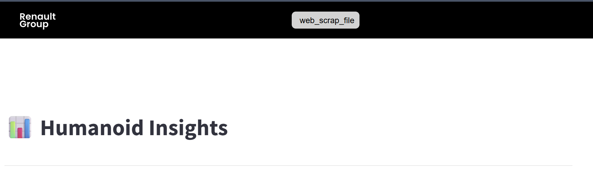

# 📦 Application de veille technologique sur les robots humanoïdes

## 📝 Introduction
Il s'agit d'une application de veille technologique sur la robotique humanoïde destinée à centraliser et simplifier l’accès aux informations clés du secteur.  
Elle collecte automatiquement les dernières informations dans le domaine et présente diverses analyses sur les robots humanoïdes. Qu'il s'agisse de la comparaison de leurs spécifications techniques, du suivi de l'évolution de leurs prix dans différentes régions du monde, du suivi des levées de fonds dans le secteur,... une très grande variété d'analyses y sont présentées.
Elle permet également de récupérer de manière semi-automatique les informations sur les robots humanoïdes les plus récemments révélés sur le marché pour pouvoir les ajouter aux analyses faites dans l'application.
---

## 🚀 Installation

### Prérequis
Pour pouvoir utiliser l'application, il est nécessaire de disposer de :

- Streamlit  
- Plotly  
- Pandas  
- LangChain  
- langchain_community  
- LangGraph  
- rapidfuzz  

### Étapes
1. Cloner le dépôt :  
   ```bash
   git clone https://github.com/ton-projet.git
   ```


## Utilisation
Une fois l'application installée, vous pouvez la lancer en suivant ce processus :

Dans votre terminal :
1. Parcourez vos dossiers pour arriver au dossier source de l'application :
  ```bash
   cd C:\Users\jusqu\a\robotic-watch-app\src
   ```
2. Lancez l'application en entrant la commande suivante :
   ```bash
   streamlit run app.py
   ```
### Mode Utilisateur
L'application tournera automatiquement pour vous présenter les analyses réalisées.

Un QR code sera disponible après la présentation de l'ensemble des analyses.
N'hésitez pas à le scanner pour accéder aux sources utilisées.

### Mode administrateur
Pour relancer une nouvelle recherche de robots humanoïdes les plus récents :

1. Survolez la bande noire en haut de l'application avec la souris jusqu'à ce qu'un bouton apparaisse :


2. Vous aurez ainsi accès à la page de lancement de recherche de nouveau robot, nécessitant une identification :
      **Identifiants requis :**  
| Identifiant     | Valeur |
|-----------------|--------|
| **Username**    | root   |
| **Password**    | root   |


3. Vous aurez ainsi deux choix lancer une nouvelle recherche de robots humanoïdes ou continuer avec les robots récupérés précédemment.
4. Ensuite pour chaque robot un système multi-agents IA se lancera en arrière-plan pour remplir les informations de ce dernier dans la base de données et l'ajouter ainsi aux analyses.
5. Si un robot récupéré à un nom similaire à d'autres déjà présents dans la base de données, pour chaque robot vous pourrez signaler s'ils sont:
   - Identiques
   - Différents
S'ils sont identiques vous pourrez choisir ce que vous souhaitez faire avec le robot trouvé précédemment :
   - L'ignorer
   - L'ajouter (si celui-ci n'avait effectivement pas le même nom qu'un autre il sera gardé, autrement il sera effacé avant les analyses)
   - Mettre à jour le robot déjà présent dans la base de données avec les données du nouveau robot
6. Une fois la recherche complétée, attendez que l'application signale que le nettoyage de la base de données a été effectuée.
7. Déconnectez-vous en cliquant sur le bouton **logout**
8. Cliquez sur le logo **Renault Group** pour lancer la page principale de l'application.


