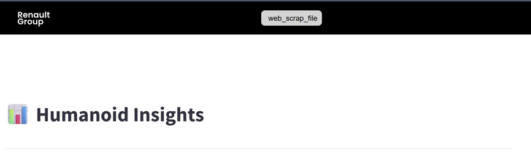

# 📦 Application de veille technologique sur les robots humanoïdes

---
## 📝 Introduction

Il s'agit d'une application de veille technologique sur la robotique humanoïde destinée à centraliser et simplifier l’accès aux informations clés du secteur.  
Elle collecte automatiquement les dernières informations dans le domaine et présente diverses analyses sur les robots humanoïdes. Qu'il s'agisse de la comparaison de leurs spécifications techniques, du suivi de l'évolution de leurs prix dans différentes régions du monde, du suivi des levées de fonds dans le secteur,... une très grande variété d'analyses y sont présentées.
Elle permet également de récupérer de manière semi-automatique les informations sur les robots humanoïdes les plus récemments révélés sur le marché pour pouvoir les ajouter aux analyses faites dans l'application.
---

## 🚀 Installation

### Prérequis
Pour pouvoir utiliser l'application, il est nécessaire de disposer de :
- Python
- Streamlit  
- Plotly  
- Pandas  
- LangChain  
- langchain_community  
- LangGraph  
- rapidfuzz

Tout s'installera automatiquement à la suite de l'utilisation du fichier requirements.txt

***Pour le mode administrateur***

- OpenAI API
- TavilySearch API

### Étapes

### Usage Personnel
1. **Cloner le dépôt :**
   ```bash
   git clone https://github.com/MyriamA6/robotic-watch-app
   cd robotic-watch-app
   ```
   
2. **Créer un environnement virtuel (recommandé)** : 
    ```bash
    python -m venv venv
    ```
        
    Puis activer l’environnement :
    
    Windows : `venv\Scripts\activate`
    
    macOS / Linux :
            `source venv/bin/activate`


3. **Installer les dépendances** :
    ```bash
    pip install -r requirements.txt
    ```

4. **Configurer les variables d’environnement** :
Créez un fichier .env dans le dossier src/pages et ajoutez-y vos clés _**OpenAI**_ et _**Tavily Search**_ :
    ```env
    OPENAI_API_KEY=your_api_key_here
    TAVILY_API_KEY=your_free_api_key_here
    ```

5. **Lancer l’application**:

    ```bash
    cd src
    streamlit run app.py
    ```
### Sur le Raspberry Pi 5
1. Connectez le Raspberry Pi à un clavier, souris et écran.
2. Ajustez la résolution de l'écran :
   * Cliquez sur la framboise en haut à gauche
   * Aller dans Screen Configuration > Preferences > Resolution
   * Réduisez ou augmentez la résolution si nécessaire
   * **Remarque : Pour les écrans 4K du Technocentre, une résolution de 1280 x 768 est recommandée pour un affichage optimal.**

### Mode Utilisateur
L'application tournera automatiquement pour vous présenter les analyses réalisées.

Un QR code sera disponible après la présentation de l'ensemble des analyses.
N'hésitez pas à le scanner pour accéder aux sources utilisées.

### Mode administrateur
Pour relancer une nouvelle recherche de robots humanoïdes les plus récents ou une mise à jour des données financières des entreprises. 
Vous pouvez passer par le terminal en exécutant le fichier `terminal_web_scrap_file.py` ou directement via l'application (des bugs restent à corriger):

1. Survolez la bande noire en haut de l'application avec la souris jusqu'à ce qu'un bouton apparaisse :



2. Vous aurez ainsi accès à la page de lancement de recherche de nouveau robot, nécessitant une identification :  
      
      | Identifiant     | Valeur   |
      |-----------------|----------|
      | **Username**    | `root`   |
      | **Password**    | `root`   |


3. Vous aurez ainsi plusieurs choix  :

   * Lancer une nouvelle recherche de robots humanoïdes automatique.

   * Faire une recherche manuelle, il suffit de modifier le document `latest_humanoid_robot.csv` et d'entrer le nom et l'entreprise du robot ou des robots, que vous souhaitez ajouter à la base de données, comme suit :
           ```
               [
               {"name": "Unitree G1", "company": "Unitree"},
               {"name": "RobotERA L7", "company": "RobotERA"}
               ]
           ```
   * Lancer une mise à jour des données financières des entreprises
4. Ensuite pour chaque robot un système multi-agents IA se lancera en arrière-plan pour remplir les informations de ce dernier dans la base de données et l'ajouter ainsi aux analyses.
5. Si un robot récupéré à un nom similaire à d'autres déjà présents dans la base de données, pour chaque robot vous pourrez signaler s'ils sont:

   * Identiques
   * Différents 
 
    S'ils sont identiques vous pourrez choisir ce que vous souhaitez faire avec le robot trouvé précédemment :

   * L'ignorer
   * L'ajouter (si celui-ci n'avait effectivement pas le même nom qu'un autre il sera gardé, autrement il sera effacé avant les analyses)
   * Mettre à jour le robot déjà présent dans la base de données avec les données du nouveau robot

6. Une fois la recherche complétée, attendez que l'application signale que le nettoyage de la base de données a été effectuée.
7. Déconnectez-vous en cliquant sur le bouton **logout**
8. Cliquez sur le logo **Renault Group** pour lancer la page principale de l'application.

Si besoin vous pouvez changer l'_username_ et le _password_ de la page administrateur en changeant le fichier `config.yaml`

